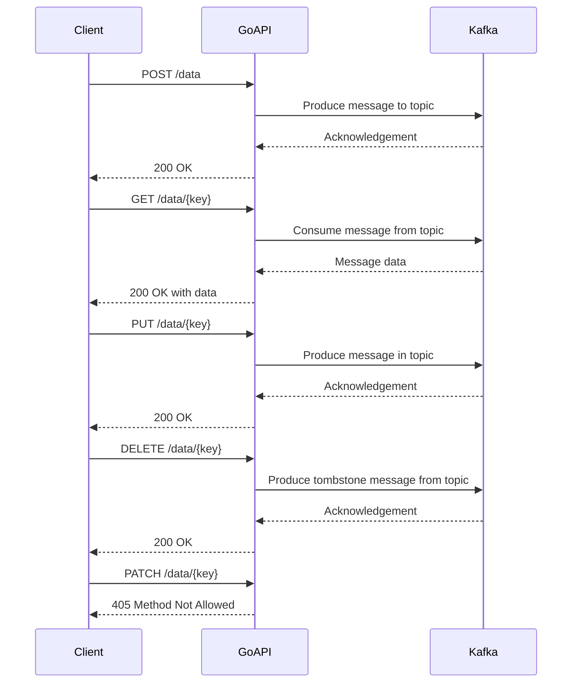

# Project kafka-go-rest

# Kafka Go REST API

This project will create a REST API using Golang. The data will be saved in a Kafka topic. The API will support POST, PUT, GET (ALL and By key) and DELETE OPTION



## Design Considerations
1. Kafka Topic will be created with `compacted` cleanup policy.
2. No difference in `POST` and `PUT` operation.
3. `DELETE` operation will produce a tombtone message to kafka topic.
4. `GET /{key}` will pull the latest message with the key
5. `GET /` will pull the all the latest messages for every key
6. The key and value both will be serialized as String (JSON String)
7. As of now a fixed set of entities to be supported.


## Getting Started

These instructions will get you a copy of the project up and running on your local machine for development and testing purposes. See deployment for notes on how to deploy the project on a live system.

## MakeFile

Run build make command with tests
```bash
make all
```

Build the application
```bash
make build
```

Run the application
```bash
make run
```

Live reload the application:
```bash
make watch
```

Run the test suite:
```bash
make test
```

Clean up binary from the last build:
```bash
make clean
```
